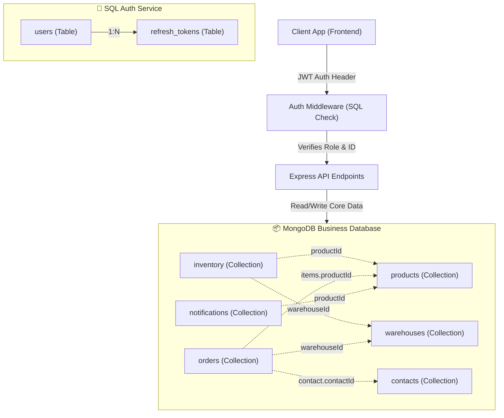

# StockWise Hybrid Database Design Schema

This document provides a highly professional, practical **Hybrid Database Schema** for the **StockWise** inventory management system. 

Following your architectural requirement:
* 🔐 **SQL (MySQL / PostgreSQL)** is used exclusively for the **User Authentication Service** (secure, robust role enforcement and token management).
* 📦 **MongoDB (NoSQL)** is used for the remaining **Core Business Services** (Products, Warehouses, Inventory, Orders, CRM Contacts, and Analytics/Notifications).

---

## 🏗️ Architectural Overview & Data Flow



---

## Part 1: Oracle SQL Authentication Database Schema

Relational tables designed in Oracle database dialect for precise authorization, role management, and session invalidation.

### 🗄️ Oracle SQL Tables Specifications

#### 1. `users` Table
Stores registered system users with Role-Based Access Control (RBAC) levels.
* **Columns**:
  * `user_id` (NUMBER): **Primary Key**, Identity column (`GENERATED BY DEFAULT AS IDENTITY`).
  * `username` (VARCHAR2(50)): Unique, Not Null. (Used for login validation).
  * `email` (VARCHAR2(100)): Unique, Not Null.
  * `password_hash` (VARCHAR2(255)): Not Null. (Always store hashed values using bcrypt/argon2).
  * `role` (VARCHAR2(20)): Not Null. Values constraint: `CHECK (role IN ('Admin', 'Manager', 'Staff'))`.
  * `created_at` (TIMESTAMP): Defaults to `CURRENT_TIMESTAMP`.
  * `updated_at` (TIMESTAMP): Automatically updated on row edits via the Oracle row trigger `trg_users_updated_at`.

#### 2. `refresh_tokens` Table
Supports active session tracking, token refresh requests, and full logouts (revocation).
* **Columns**:
  * `token_id` (NUMBER): **Primary Key**, Identity column (`GENERATED BY DEFAULT AS IDENTITY`).
  * `user_id` (NUMBER): **Foreign Key** references `users(user_id)` with `ON DELETE CASCADE`.
  * `token` (VARCHAR2(255)): Unique, Not Null.
  * `expires_at` (TIMESTAMP): Not Null.
  * `created_at` (TIMESTAMP): Defaults to `CURRENT_TIMESTAMP`.

#### 3. `password_resets` Table (Optional / Expansion)
Manages temporary tokens for secure, email-based password recovery.
* **Columns**:
  * `reset_id` (NUMBER): **Primary Key**, Identity column (`GENERATED BY DEFAULT AS IDENTITY`).
  * `email` (VARCHAR2(100)): Not Null.
  * `token` (VARCHAR2(255)): Unique, Not Null.
  * `expires_at` (TIMESTAMP): Not Null.
  * `created_at` (TIMESTAMP): Defaults to `CURRENT_TIMESTAMP`.
  * `used` (NUMBER(1)): Defaults to `0` (False). Values constraint: `CHECK (used IN (0, 1))`.

#### 4. `login_history` Table (Optional / Auditing)
Logs access events to audit active usage and discover malicious attempts.
* **Columns**:
  * `login_id` (NUMBER): **Primary Key**, Identity column (`GENERATED BY DEFAULT AS IDENTITY`).
  * `user_id` (NUMBER): **Foreign Key** references `users(user_id)` with `ON DELETE SET NULL`.
  * `attempted_username` (VARCHAR2(50)): Not Null.
  * `ip_address` (VARCHAR2(45)): Nullable (IPv4/IPv6 support).
  * `user_agent` (VARCHAR2(255)): Nullable.
  * `status` (VARCHAR2(10)): Not Null. Values constraint: `CHECK (status IN ('Success', 'Failed'))`.
  * `created_at` (TIMESTAMP): Defaults to `CURRENT_TIMESTAMP`.

---

## Part 2: MongoDB Business Database Schema (NoSQL)

Leverages document denormalization to nest sub-records (like Order Line Items and contact summaries) for rapid single-query reads while referencing core models (like Product and Warehouse details).

### 📁 Collections & BSON Formats

#### 1. `products` Collection
Main product catalog configuration.
```json
{
  "_id": "ObjectId",
  "sku": "PROD-LAP-001",
  "name": "ProBook 14-inch Laptop",
  "description": "High-performance business laptop",
  "category": "Electronics",
  "price": 899.99,
  "lowStockThreshold": 15,
  "createdAt": "date",
  "updatedAt": "date"
}
```

#### 2. `warehouses` Collection
Addresses and contact records for multiple storage branches.
```json
{
  "_id": "ObjectId",
  "name": "Central Distribution Hub",
  "location": "123 Supply Chain Ave, Seattle, WA",
  "contact": {
    "phone": "+1-206-555-0199",
    "email": "central_hub@stockwise.com"
  },
  "createdAt": "date"
}
```

#### 3. `inventory` Collection
Maintains stock quantity counts per product in each warehouse. Includes a `version` attribute for optimistic concurrency control.
```json
{
  "_id": "ObjectId",
  "productId": "ObjectId", // Reference to products collection
  "warehouseId": "ObjectId", // Reference to warehouses collection
  "quantity": 120,
  "version": 1, // Atomic transaction helper
  "updatedAt": "date"
}
```
> [!TIP]
> Ensure a unique compound index is created on `{ productId: 1, warehouseId: 1 }` to prevent redundant stock entries.

#### 4. `contacts` Collection (CRM Suppliers & Customers)
Holds trade details, tiers, agreements, and a small embedded transaction log for instant history search.
```json
{
  "_id": "ObjectId",
  "type": "Customer", // "Supplier" or "Customer"
  "name": "Acme Industries",
  "email": "procurement@acme.com",
  "phone": "+1-800-555-0143",
  "address": {
    "street": "789 Corporate Boulevard",
    "city": "Chicago",
    "state": "IL",
    "zip": "60601"
  },
  "pricingTier": "Gold", // "Standard", "Silver", "Gold", "VIP"
  "agreement": {
    "discountPercentage": 10.0,
    "paymentTerms": "NET30",
    "notes": "Premium client contract"
  },
  "transactionSummary": [ // Nested snap-list of recent transactions for CRM views
    {
      "orderId": "ObjectId",
      "orderNumber": "SO-2026-0087",
      "orderType": "Sales",
      "totalAmount": 4500.00,
      "date": "date"
    }
  ],
  "createdAt": "date",
  "updatedAt": "date"
}
```

#### 5. `orders` Collection (Purchase & Sales)
An order embeds its line items directly as a nested array for sub-millisecond document loading.
```json
{
  "_id": "ObjectId",
  "orderType": "Sales", // "Purchase" (Inbound) or "Sales" (Outbound)
  "orderNumber": "SO-2026-0104",
  "contact": { // Embedded CRM snapshot for rapid invoices
    "contactId": "ObjectId",
    "name": "Acme Industries",
    "type": "Customer"
  },
  "warehouseId": "ObjectId", // Warehouse stock source or destination
  "status": "Confirmed", // "Draft", "Pending", "Confirmed", "Completed", "Cancelled"
  "items": [
    {
      "productId": "ObjectId",
      "sku": "PROD-LAP-001",
      "name": "ProBook 14-inch Laptop",
      "quantity": 5,
      "unitPrice": 809.99, // Custom pricing tier historical rate
      "totalPrice": 4049.95
    }
  ],
  "totalAmount": 4049.95,
  "createdByUserId": "number", // Stores the SQL user_id value of the creator!
  "orderDate": "date",
  "updatedAt": "date"
}
```

#### 6. `notifications` Collection
Auditing logs for email dispatches and current unresolved low stock triggers.
```json
{
  "_id": "ObjectId",
  "type": "LowStockAlert", // "LowStockAlert" or "EmailLog"
  "productId": "ObjectId",
  "productName": "ProBook 14-inch Laptop",
  "warehouseId": "ObjectId",
  "warehouseName": "Central Distribution Hub",
  "currentStock": 8,
  "threshold": 15,
  "status": "Active", // "Active" or "Resolved"
  "emailDetails": {
    "sentTo": "manager@stockwise.com",
    "sentAt": "date",
    "subject": "⚠️ Low Stock Warning: PROD-LAP-001"
  },
  "createdAt": "date"
}
```

---

## Part 3: Hybrid Database Integration Guide

When using SQL and NoSQL together, there are a few practical rules that make student projects perform cleanly.

### 🔗 Cross-Database References (Linking SQL to Mongo)
* **SQL to Mongo**: In MongoDB documents (like `orders`), store the SQL `user_id` as a simple numeric field `createdByUserId: 12`. This links back to the SQL `users` table.
* **Mongo to SQL**: Avoid storing Mongo ObjectIds in SQL. Keep SQL as the "gatekeeper" of access controls, while Mongo stores all business workflows.

### 🔄 Optimistic Concurrency Control in MongoDB (Stock Updates)
In the core business layer, your inventory increments and decrements must check the document `version` tag to handle concurrent orders smoothly:
```javascript
const result = await db.collection("inventory").updateOne(
  { 
    productId: ObjectId("..."), 
    warehouseId: ObjectId("..."), 
    version: currentVersion 
  },
  { 
    $inc: { quantity: -orderedQty },
    $set: { updatedAt: new Date() },
    $inc: { version: 1 } 
  }
);
```

### 🛡️ Stock Availability Check (Before Outbound Sales Order)
Before writing an order document to Mongo, perform a quick check:
```javascript
const stock = await db.collection("inventory").findOne({ productId, warehouseId });
if (!stock || stock.quantity < requestedQty) {
  throw new Error("Insufficient stock in selected warehouse location!");
}
```
